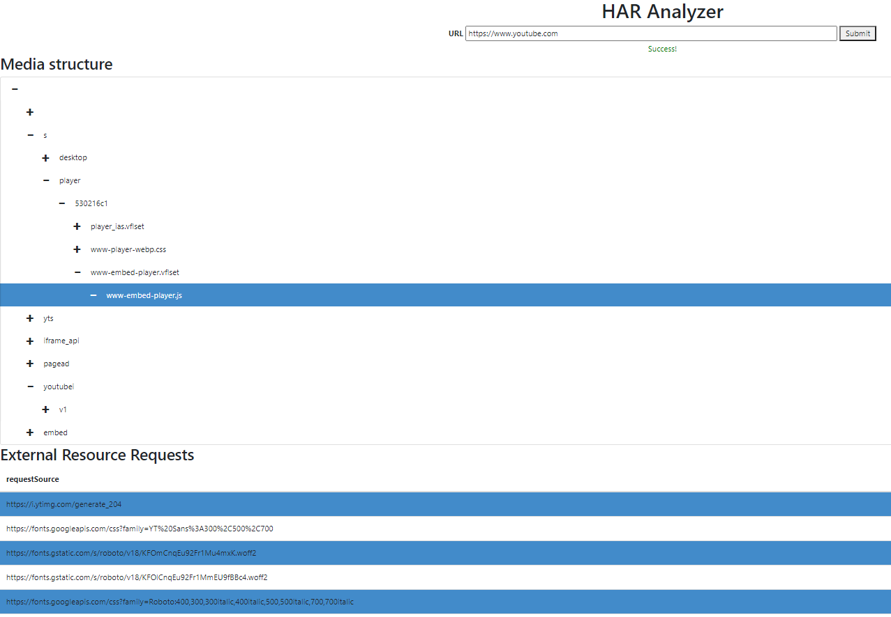

# HTTP Archive Analyser
## Description
HTTP Archive Analyser is a webservice that analyse HAR (HTTP Archive) file from provided URI. It describes web browser’s interaction with a site such as cookies, endpoints to requested external resources and media structure of returned response 
Project is hosted on Heroku platform: https://mighty-badlands-42460.herokuapp.com/

